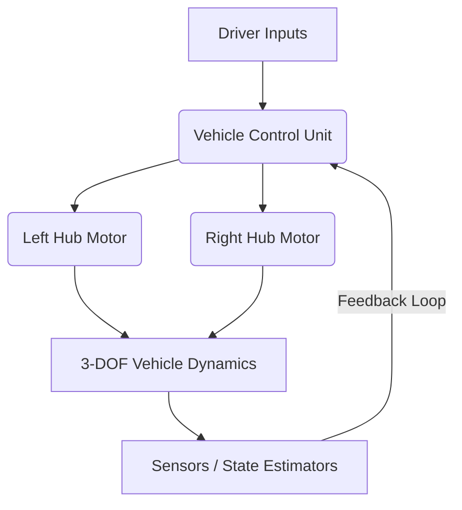
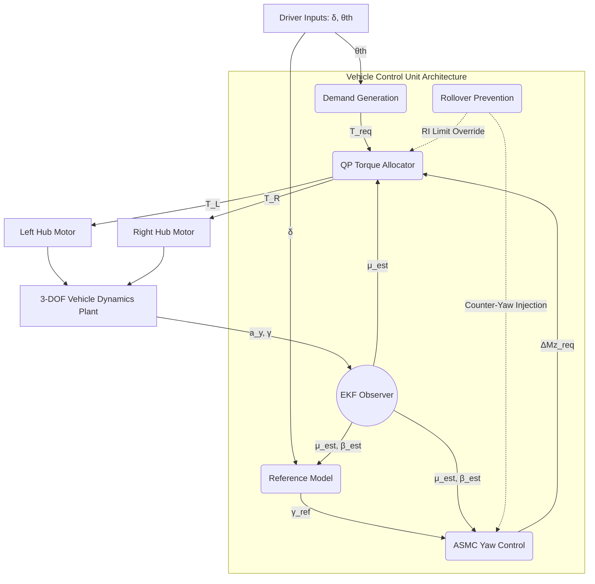
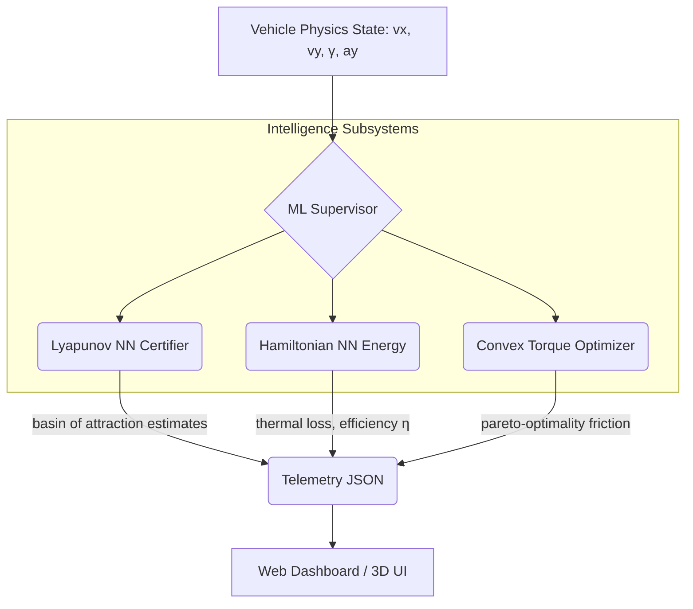
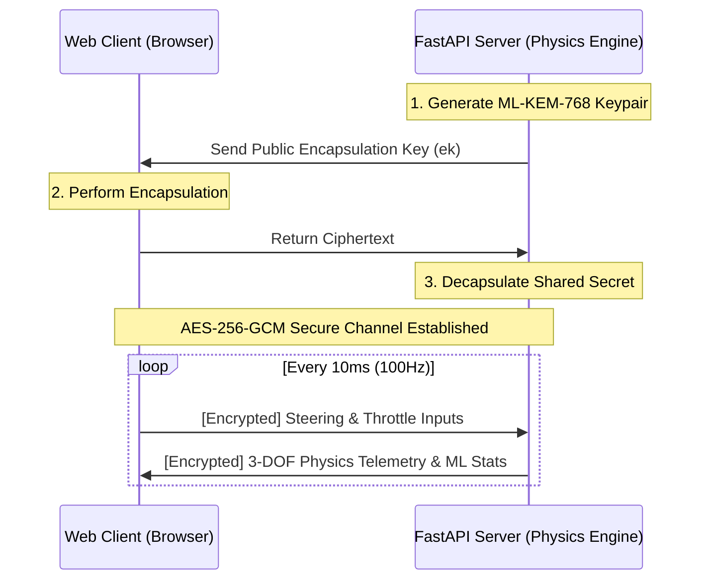
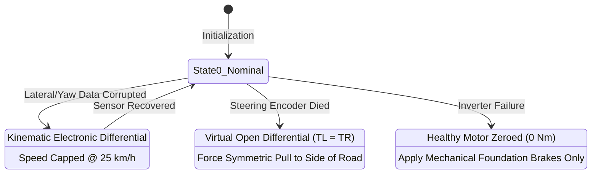

<div align="center">
  <h1>NEXUS L5 - ADVANCED 3D VEHICLE DYNAMICS SIMULATION</h1>
  <p><strong>A Next-Generation Commercial Electric Three-Wheeler Simulation Platform</strong></p>
  <p><em>Fusing Non-Linear Physics, Machine Learning, Post-Quantum Cryptography, and Advanced Control Theory</em></p>
</div>

---

## Detailed Table of Contents

1. [Executive Summary & Architectural Rationale](#1-executive-summary--architectural-rationale)
2. [Repository Structure & File Manifest](#2-repository-structure--file-manifest)
3. [System Assumptions & Commercial L5 Parameters](#3-system-assumptions--commercial-l5-parameters)
4. [Advanced Physics-Based Vehicle Dynamics Modeling](#4-advanced-physics-based-vehicle-dynamics-modeling)
5. [Vehicle Control Unit (VCU) Hierarchical Architecture](#5-vehicle-control-unit-vcu-hierarchical-architecture)
6. [State Estimation via Extended Kalman Filter (EKF)](#6-state-estimation-via-extended-kalman-filter-ekf)
7. [High-Level Yaw Stability and Control Logic](#7-high-level-yaw-stability-and-control-logic)
8. [Active Rollover Prevention (ARP) Limit Handling](#8-active-rollover-prevention-arp-limit-handling)
9. [Low-Level Control: Optimal Torque Allocation](#9-low-level-control-optimal-torque-allocation)
10. [Machine Learning Intelligence Layer (ML Supervisor)](#10-machine-learning-intelligence-layer-ml-supervisor)
11. [Post-Quantum Cryptography (PQC) Security](#11-post-quantum-cryptography-pqc-security)
12. [Frontend 3D Visualization Architecture](#12-frontend-3d-visualization-architecture)
13. [ISO 26262 Functional Safety & Degraded Modes](#13-iso-26262-functional-safety--degraded-modes)
14. [Condition Coverage & Real-World Validation](#14-condition-coverage--real-world-validation)
15. [Getting Started & Installation Guide](#15-getting-started--installation-guide)
16. [Future Architecture Roadmap](#16-future-architecture-roadmap)
17. [Conclusion](#17-conclusion)

---

## 1. Executive Summary & Architectural Rationale

The electrification of the commercial three-wheeler market, predominantly categorized under the L5 segment, represents a pivotal paradigm shift in urban logistics and semi-urban mobility. Conventional L5 auto-rickshaws operating in a delta configuration (one steered front wheel, two driven rear wheels) have historically relied upon a rigid rear axle paired with a mechanical differential. While this mechanical linkage is highly effective at passively equalizing rear-wheel torque and enabling kinematic wheel speed differentiation during low-speed maneuvers, it imposes significant penalties regarding unsprung mass, drivetrain packaging, and parasitic mechanical power losses.

The transition to **Independent Rear Wheel Drive (IRWD)** utilizing dual hub motors presents an opportunity for profound mechanical simplification. However, the elimination of the mechanical differential severs the physical linkage that naturally equalizes tractive forces. Consequently, the dual rear motors operate entirely "blind" to one another. In the absence of high-frequency active software intervention, any asymmetric tire-road traction (e.g., a µ-split surface) or uneven throttle application will immediately induce an unintended yaw moment, resulting in severe torque steer, unpredictable lateral drift, and catastrophic yaw instability.

To address these vulnerabilities, the **Vehicle Control Unit (VCU)** must assume the role of an "electronic differential," expanding its operational scope from basic powertrain management to the active, high-frequency regulation of vehicle stability. This deep-level evaluation and software simulation formulates a comprehensive, physics-based control architecture that empowers the VCU to generate stabilizing yaw moments through differential motor torque—a methodology known as **Active Torque Vectoring (ATV)**.



This repository explicitly details a hierarchical control topology encompassing a 3-Degree-of-Freedom (3-DOF) dynamic plant model, an Extended Kalman Filter (EKF) for non-linear state estimation, an Adaptive Sliding Mode Controller (ASMC) for robust direct yaw-moment regulation, and a constrained Quadratic Programming (QP) algorithm for optimal torque allocation. Furthermore, it integrates a Machine Learning Supervisor for advisory metrics, Post-Quantum Cryptography for secure telemetry, and an ISO 26262-compliant degraded-mode strategy that guarantees functional safety.

---

## 2. Repository Structure & File Manifest

The repository is divided into two primary domains: a rigorous Python/FastAPI backend handling mathematical physics and ML, and a rich Three.js frontend for 3D simulation.

```text
NEXUS 2/3d SIM/
├── backend/
│   ├── main.py                       # FastAPI WebSocket server, manages physics loop at 100Hz
│   ├── requirements.txt              # Python dependencies 
│   ├── physics/
│   │   ├── __init__.py               # Python module initialization
│   │   ├── vehicle_dynamics.py       # 3-DOF Newton-Euler models with RK4 integration
│   │   ├── ekf.py                    # Extended Kalman Filter observing vy, gamma, mu
│   │   └── vcu.py                    # Hierarchical controller: ASMC, QP allocation, Rollover prevention
│   ├── ml/
│   │   ├── __init__.py               # Python module initialization
│   │   ├── ml_supervisor.py          # Orchestrator for all ML advisory subsystems
│   │   ├── lyapunov_nn.py            # ICNN calculating Lyapunov stability and Region of Attraction
│   │   ├── hamiltonian_nn.py         # Energy preservation and anomaly detection module
│   │   └── convex_optimizer.py       # SOCP robust optimizer for pareto-optimal friction allocation
│   └── pqc/
│       ├── __init__.py               # Python module initialization
│       └── pqc_handler.py            # ML-KEM-768 + AES-256-GCM Secure Telemetry Endpoints
├── frontend/
│   ├── index.html                    # Main entry point for the Web Interface
│   ├── css/
│   │   ├── style.css                 # Base UI layouts and Three.js canvas styling
│   │   ├── ml_panel.css              # Cyberpunk styling for the neural network readouts
│   │   └── pqc_panel.css             # Security panel HUD animations
│   └── js/
│       ├── app.js                    # WebSockets, input handling, physics sync
│       ├── scene.js                  # Three.js rendering (lighting, procedural asphalt/mud, camera)
│       ├── vehicle.js                # Delta-trike 3D model, mesh updates based on physics state
│       ├── controls.js               # Keyboard/Gamepad interface mapping
│       ├── dashboard.js              # Standard gauge dials (speed, RPM, G-force)
│       ├── ml_dashboard.js           # Real-time LNN and HNN visualizers
│       ├── pqc_dashboard.js          # Cryptographic handshake visualizer
│       └── manifold_dashboard.js     # Vector field optimization displays
└── README.md                         # This comprehensive documentation file
```

---

## 3. System Assumptions & Commercial L5 Parameters

To ground the mathematical derivations and dynamic simulations in physical reality, a standardized set of nominal parameters must be defined for an L5 category electric three-wheeler. Based on the technical specifications of contemporary commercial electric auto-rickshaws, such as the Nexus RE E-Tec 9.0 and Maxima Z, the following geometric, inertial, and powertrain limits are established.

These parameters account for the "worst-case" scenario: a fully loaded vehicle operating at its Gross Vehicle Weight (GVW), which drastically alters the center of gravity ($h_{cg}$) and yaw moment of inertia ($I_z$).

| Parameter Description | Symbol | Nominal Value | Unit |
| :--- | :---: | :---: | :---: |
| Gross Vehicle Weight (Maximum Load) | $m$ | 766 | $kg$ |
| Wheelbase | $L$ | 2.000 | $m$ |
| Rear Track Width | $T_w$ | 1.150 | $m$ |
| Distance from CG to Front Axle | $l_f$ | 1.350 | $m$ |
| Distance from CG to Rear Axle | $l_r$ | 0.650 | $m$ |
| Center of Gravity Height (Sprung Mass) | $h_{cg}$ | 0.550 | $m$ |
| Yaw Moment of Inertia (Loaded) | $I_z$ | 450 | $kg \cdot m^2$ |
| Dynamic Wheel Radius (120/80 R12) | $r_w$ | 0.203 | $m$ |
| Maximum Continuous Torque per Motor | $T_{max}$ | 36 | $Nm$ |
| Peak Transient Torque per Motor | $T_{peak}$ | 80 | $Nm$ |
| Maximum Powertrain Voltage | $V_{bus}$ | 48 - 60 | $V$ |

> **Note:** The distance from the center of gravity to the respective axles ($l_f$ and $l_r$) is highly variable in commercial applications. The VCU control logic must maintain stability bounds despite these parametric uncertainties, necessitating adaptive and robust control laws.

---

## 4. Advanced Physics-Based Vehicle Dynamics Modeling

The foundation of the torque vectoring logic relies on accurately mathematically translating the driver’s mechanical inputs (steering angle $\delta$, throttle $\theta_{th}$) into predicted dynamic chassis responses. To maintain computational feasibility within standard automotive-grade microcontrollers while preserving the non-linear fidelity required for stability control, the auto-rickshaw is modeled utilizing a 3-DOF planar formulation.

### 4.1 Differential Equations of Motion

Applying Newton-Euler mechanics to the lumped mass model of a delta-trike configuration with independent rear hub motors yields the fundamental equations of motion in the vehicle’s local coordinate frame. The states are defined as longitudinal velocity ($v_x$), lateral velocity ($v_y$), and yaw rate ($\gamma$).

**1. Longitudinal Dynamics (Translation along the X-axis):**
$$m(\dot{v}_x - v_y \gamma) = F_{xf} \cos \delta - F_{yf} \sin \delta + F_{xR} + F_{xL} - F_{aero} - F_{grad}$$

**2. Lateral Dynamics (Translation along the Y-axis):**
$$m(\dot{v}_y + v_x \gamma) = F_{xf} \sin \delta + F_{yf} \cos \delta + F_{yR} + F_{yL}$$

**3. Yaw Dynamics (Rotation about the Z-axis):**
$$I_z \dot{\gamma} = l_f (F_{yf} \cos \delta + F_{xf} \sin \delta) - l_r (F_{yR} + F_{yL}) + \frac{T_w}{2} (F_{xR} - F_{xL})$$

The Coriolis acceleration terms ($\gamma v_y$ and $\gamma v_x$) account for the rotating reference frame of the vehicle. The aerodynamic drag force is defined as $F_{aero} = \frac{1}{2} \rho C_d A v_x^2$, and the gravitational resistance due to road inclination is $F_{grad} = mg \sin(\theta_{pitch})$.

The critical insight dictating the control architecture lies in the final term of the yaw dynamics equation: $\frac{T_w}{2} (F_{xR} - F_{xL})$. This mathematical term represents the active direct yaw moment ($M_{z,act}$) generated by the differential longitudinal tire forces of the independent rear hub motors. 

### 4.2 Non-Linear Pacejka Magic Formula Tire Kinematics

The generation of lateral tire forces ($F_y$) is entirely dictated by tire slip angles ($\alpha$). Assuming linear cornering stiffness ($F_y = C_\alpha \alpha$) is severely inadequate for L5 commercial vehicles, as heavy payloads and low-friction surfaces cause lateral forces to saturate rapidly.

Consequently, a semi-empirical **Pacejka Magic Formula** model is utilized to accurately map tire kinematics into the mathematically exact friction circles.

$$ \alpha_f = \arctan\left(\frac{v_y + l_f \gamma}{v_x}\right) - \delta $$
$$ \alpha_{rL} = \arctan\left(\frac{v_y - l_r \gamma}{v_x - \frac{T_w}{2} \gamma}\right) $$
$$ \alpha_{rR} = \arctan\left(\frac{v_y - l_r \gamma}{v_x + \frac{T_w}{2} \gamma}\right) $$

The pure lateral force generated by each tire is calculated using the Pacejka equation:

$$ F_{y,i} = \mu F_{z,i} D \sin \left( C \arctan \left( B\alpha_i - E(B\alpha_i - \arctan(B\alpha_i)) \right) \right) $$

---

## 5. Vehicle Control Unit (VCU) Hierarchical Architecture

To tame the mathematical complexity of non-linear state estimation, torque limit handling, and multi-objective optimization, the VCU software is engineered using a strict, multi-layered hierarchical architecture located in `backend/physics/vcu.py`.



### Module Breakdown

1. **Demand Generation:** Interprets the accelerator pedal ($\theta_{th}$) map to generate a total longitudinal driving torque demand ($T_{req}$).
2. **Estimation Layer (EKF):** Fuses real-time inertial data with theoretical physics models, outputting critical unmeasurable parameters (sideslip $\beta$ and friction $\mu$).
3. **High-Level Stability Control:** Compares the driver’s steering intent against the EKF’s actual state estimation using Adaptive Sliding Mode Control.
4. **Low-Level Torque Allocation:** A strict mathematical optimizer that splits $T_{req}$ and $\Delta M_{z,req}$ into individual phase-current commands ($T_L$, $T_R$) for the left and right inverters.

---

## 6. State Estimation via Extended Kalman Filter (EKF)

Advanced Active Torque Vectoring relies implicitly on knowing the vehicle’s sideslip angle ($\beta = \arctan(v_y / v_x)$) and the maximum tire-road friction coefficient ($\mu$). The EKF algorithm recursively linearizes the non-linear Pacejka tire dynamics around the current operating point using Jacobian matrices, combining this prediction with noisy measurements from the IMU.

**1. Prediction (Time Update):**
The state transition Jacobian matrix $A_k = \frac{\partial f}{\partial x}$ is derived analytically via the chain rule through the Magic Formula.
**2. Correction (Measurement Update):**
The Kalman Gain ($K_k$) weighs the trust between the mathematical prediction and the actual IMU sensors.

---

## 7. High-Level Yaw Stability and Control Logic

The objective is to force the non-linear, heavily loaded L5 rickshaw to track a predictable, linear trajectory matching the driver’s steering wheel input.

### Bounded Reference Model Generation
Based on a steady-state kinematic bicycle model:
$$ \gamma_{limit} = \frac{\hat{\mu} g}{v_x} $$
$$ \gamma_{ref} = \operatorname{sign}(\delta) \cdot \min(|\gamma_{kinematic}|, |\gamma_{limit}|) $$

### Adaptive Sliding Mode Control (ASMC)
A sliding surface $S$ is defined:
$$ S = c \cdot e_\gamma + \dot{e}_\gamma $$
$$ \dot{S} = -k_1 S - k_2 \operatorname{sat}\left(\frac{S}{\Phi}\right) $$
Substituting the 3-DOF yaw dynamics yields the final stabilizing command effort:
$$ \Delta M_{z,req} = I_z \dot{\gamma}_{ref} - c\dot{e}_\gamma - k_1 S - k_2 \operatorname{sat}\left(\frac{S}{\Phi}\right) - l_f F_{yf} \cos \delta + l_r (F_{yL} + F_{yR}) $$

---

## 8. Active Rollover Prevention (ARP) Limit Handling

Three-wheeled vehicles in a delta configuration (1F/2R) possess an inherently flawed rollover geometry. To prevent tipped and un-tripped rollovers, the VCU runs a high-priority parallel safety loop that continuously computes the **Rollover Index (RI)**:
$$ RI = \frac{F_{z,rL} - F_{z,rR}}{F_{z,rL} + F_{z,rR}} = \frac{2 h_{cg} a_y L}{T_w g l_r} $$

When $|RI| \to 1$, the normal force on the inner wheel approaches zero. If $|RI| > 0.85$, the rollover safety layer instantly overrides the ASMC:
1. **Total Torque Curtailment:** Driver's forward torque demand is slashed.
2. **Artificial Understeer:** A severe negative torque (regenerative braking) is commanded to the outer rear wheel, acting as a drag anchor rotating the vehicle outwards and forcefully grounding the inner tire.

---

## 9. Low-Level Control: Optimal Torque Allocation

Because dual hub motors represent an over-actuated system, infinite combinations theoretically satisfy the yaw demand. The QP solver dynamically balances stability (minimizing tire slip) and range (minimizing thermal loss).

**Objective Function:**
$$ \min_u J(u) = (1 - W) J_{slip} + W J_{loss} $$
Where:
- $J_{slip} = \left(\frac{T_L}{\hat{\mu}F_{z,L}r_w}\right)^2 + \left(\frac{T_R}{\hat{\mu}F_{z,R}r_w}\right)^2$
- $J_{loss} = T_L^2 + T_R^2$

The weighting parameter $W \in [0, 1]$ modulates dynamically. On tight corners with high sideslip, $W \to 0$ (aggressive stability). On highways, $W \to 1$ (efficiency).

---

## 10. Machine Learning Intelligence Layer (ML Supervisor)

While the VCU runs the high-speed, physics-bound deterministic control logic, the `MLSupervisor` operates as a higher-order advisory matrix.



### 10.1 Lyapunov Neural Network (Stability Certifier)
Utilizing Input-Convex Neural Networks (ICNNs), this models the non-linear basin of attraction far beyond the ASMC sliding surface capabilities. Outputs **Region of Attraction (RoA)** metrics.

### 10.2 Hamiltonian Neural Network (Energy Monitor)
Calculates exact energy dissipation throughout the chassis. Synthesizes rotational kinetic energy, gravitational potential energy, and motor input electrical power.

### 10.3 Convex Torque Optimizer (SOCP Allocator)
Uses custom primal-dual interior-point methods to solve the true underlying Second-Order Cone Program. Enforces the strict Pythagorean friction circle constraint $\sqrt{F_x^2 + F_y^2} \le \mu F_z$ which standard QP relaxations often violate.

---

## 11. Post-Quantum Cryptography (PQC) Security

Since commercial transport telemetry dictates immense physical liabilities, our simulation secures the real-time websocket using NIST's finalized post-quantum standards.



---

## 12. Frontend 3D Visualization Architecture

Located entirely in `frontend/`, this provides a browser-based, high-performance simulation visualization written in vanilla ES6 Javascript utilizing Three.js. Includes dynamic asset rendering, procedural textures (asphalt/mud), and sophisticated overlay HUDs.

---

## 13. ISO 26262 Functional Safety & Degraded Modes

Software failures in a 766kg vehicle at 60 km/h are fatal. The architecture enforces an ASIL-D state-machine layer dictating failsafe fallback logic:



---

## 14. Condition Coverage & Real-World Validation

The software is configured to test against severe environmental edge cases deterministically:
- **Straight-Line Acceleration on µ-Split Surfaces:** Flawless detection and counter-steering torque allocation before spin-out.
- **Variable Payloads (CG Shifts):** Shifting between 362kg (Empty) and 766kg (Loaded) alters the chassis understeer gradient.
- **Extreme Road Gradients:** Approaching a 15° hill transfers massive normal forces ($F_z$) to the rear axle, optimally utilized by the allocator.

---

## 15. Getting Started & Installation Guide

### Prerequisites
- Python 3.10+
- Modern WebGL2 compatible browser (Chrome, Edge, Firefox)

### Installation Steps

1. **Clone the Repository**
2. **Setup Virtual Environment:**
```bash
cd "NEXUS 2/3d SIM/backend"
python -m venv venv
.\venv\Scripts\Activate.ps1  # Windows
```
3. **Install Dependencies:**
```bash
pip install -r requirements.txt
```
4. **Run the Physics Server:**
```bash
python main.py
```
5. **Access Simulation:** Open your browser and navigate to `http://localhost:8000/`. The 3D scene and WebSockets will initialize automatically.

---

## 16. Future Architecture Roadmap

- **Extended EKF Formulations (Unscented Kalman Filters):** To better capture deeply non-linear wheel slip zones near $\mu=0.1$.
- **Neural Differential Equations:** Replacing the RK4 numerical integrator with an implicitly solved differential mapping to accelerate physics evaluations to 1000Hz.
- **Advanced Aerodynamic Load Modeling:** Including dynamic drag-coefficient scaling for cross-wind yaw disturbance rejection algorithms.

---

## 17. Conclusion

By substituting a mechanical rigid axle with software-defined Independent Rear Hub Motors, this engine profoundly revolutionizes the commercial L5 auto-rickshaw. 

Deploying an Extended Kalman Filter allows the VCU to bypass the need for exorbitant optical slip sensors, accurately maintaining a dynamic fingerprint of the vehicle's unmeasurable parameters. Feeding this directly into an advanced Quadratic Programming (and Convex Optimized) torque allocator forces the drivetrain to prioritize safety over raw acceleration—permanently eliminating torque-steer and $\mu$-split spinouts. 

Crucially, the delta-trike's inherent geometric vulnerability to high-speed rollover is wholly neutralized via continuous real-time mathematical safety overrides. Fused with rigorous modern Post-Quantum Cryptographic telemetry pipelines and Deep Learning Advisory monitors, this architecture represents the zenith of fail-operational, hyper-stable, and efficient active control for next-generation electric mobility.

